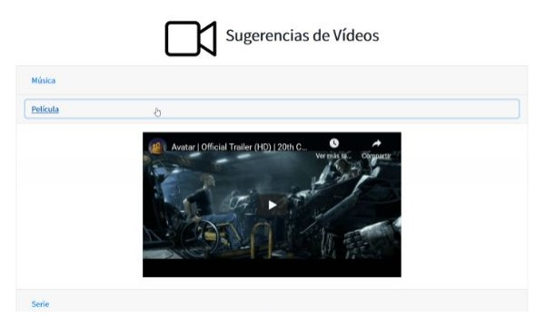
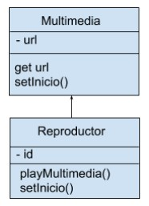
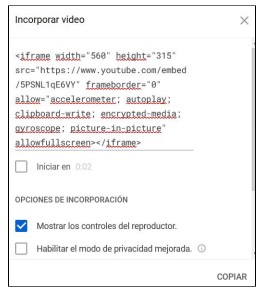

<!DOCTYPE html>
<html>

<head>
  <meta charset="utf-8">
  <meta name="viewport" content="width=device-width, initial-scale=1.0">
  <link rel="stylesheet" href="https://stackedit.io/style.css" />
</head>

<body class="stackedit">
  

    <h1 id="github-pages">Github pages</h1>
    
<a href="https://josefamendezpruebaunodl.ga/Unidad_3/3_1_VariablesYOperadoresLogicos/index.html">Vista
        del proyecto</a>

    <h1 id="desafío">Descripción </h1>
    
Un nuevo cliente necesita un sitio web que muestre sugerencias de vídeos, por el momento,
    requiere que se muestre una sola sugerencia por categoría, siendo las categorías: Música,
    Película y Serie. Estas categorías estarán ubicadas en un menú colapsable, permitiendo
    mostrar una categoría a la vez con un solo clic o también ocultar todas las categorías. Por
    ende, lo que debe aparecer en cada categoría es un vídeo, puede ser desde cualquier
    repositorio en la nube o incrustado de forma local. Pero cada vídeo debe hacer referencia a
    la categoría a la cual se hace un click. Como se muestra a continuación:
     
     
    
     
     
    
     
     
    Es importante destacar que el propósito de este desafío es trabajar directamente en un
archivo JavaScript, por lo tanto, en el archivo denominado Apoyo Desafío - Sugerencia de
Vídeos, encontrarás todos los archivos necesarios, como: imagen, maqueta HTML y hoja de
estilos. Igualmente, el menú colapsable ya está funcionando con Bootstrap, y tienen
disponibles las etiquetas iframe sin el url respectivo, por lo que solo hace falta que muestren
los vídeos automáticamente al cargar la página web, quedando disponibles para cuando el
usuario haga un click sobre cada título del menú. La url para estos videos será insertada
dinámicamente desde JavaScript implementando clases, polimorfismo, closures y patrón
módulo. Partiendo del siguiente diagrama de clases:
     
     
    
   

    <h1>Requerimientos</h1>
    <ol>
        <li>
          Implementar el Patrón Módulo mediante IIFE, en donde:
           
           
          <ul>
            <li>
            Se cree una función privada que reciba la url del video y el id de la etiqueta
iframe, para así poder mostrar los videos en el documento HTML. Dato:
puedes utilizar la instrucción “setAttribute” para manipular el DOM.
            </li>
             
            <li>
            Se retorne una función pública que reciba los parámetros (url, id), y realice el
            llamado a la función interna (privada) para insertar los elementos recibidos.
            </li>
          </ul>
        </li>
         
        <li>
        Establecer una clase padre denominada Multimedia para:
         
         
        <ul>
          <li>
          Recibir la propiedad url, ejemplo:
          “https://www.youtube.com/embed/5PSNL1qE6VY”, la cual será el atributo src que necesite la etiqueta iframe para poder mostrar el video
           
           
           
          </li>
           
          <li>
          Proteger el atributo de la clase implementado closures
          </li>
           
          <li>
          Agregar un método denominado “setInicio”, que retorne el siguiente mensaje:
          “Este método es para realizar un cambio en la URL del video”
          </li>
        </ul>
        </li>
         
        <li>
        Crear una clase “Reproductor”, siendo hija de la clase padre Multimedia para:
         
         
          <ul>
            <li>
            Recibir la propiedad id, la cual será el elemento del DOM que se necesita para
poder agregar la URL en la etiqueta iframe que corresponda. Por ejemplo: Si se envía una URL para Música, el id debe ser el perteneciente a la etiqueta
iframe que se encuentra en la sección de música.
            </li>
            <li>
            Crear un método denominado “playMultimedia”, que permita hacer el llamado a la función pública de la IIFE, enviando los atributos url y id.
            </li>
            <li>
            Agregar un método denominado “setInicio”, que reciba y agregue un tiempo
            de inicio a la URL de la etiqueta iframe. Se puede utilizar el método "setAttribute” para modificar la URL agregando al final de la misma lo
            siguiente: “?start=${tiempo}”. Esto permitirá que cualquiera de los videos que
            implemente el método inicie en el tiempo pasado como argumento al método
            al ser invocado.
            </li>
          </ul>
        </li>
         
        <li>
         Instanciar la clase hija pasando como argumento la URL y el id para cada etiqueta
        iframe, por lo que se deben crear tres instancias, una para música, otra para película y otra para serie, con sus respectivas URL.
        </li>
         
        <li>
        Invocar al método “playMultimedia” para cada instancia creada, mostrando así los
        videos en el documento HTML.
        </li>
         
        <li>
        Utiliza el método “setInicio” para modificar el tiempo de inicio en alguna de las
      instancias creadas.
        </li>
    </ol>
  

</body>

</html>
