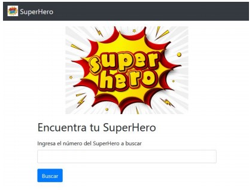
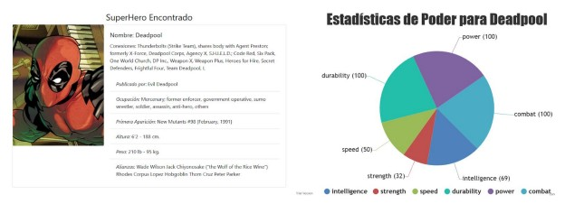

<!DOCTYPE html>
<html>

<head>
  <meta charset="utf-8">
  <meta name="viewport" content="width=device-width, initial-scale=1.0">
  <link rel="stylesheet" href="https://stackedit.io/style.css" />
</head>

<body class="stackedit">
  

    <h1 id="github-pages">Github pages</h1>
    
<a href="https://josefamendezpruebaunodl.ga/Unidad_3/3_1_VariablesYOperadoresLogicos/index.html">Vista
        del proyecto</a>

    <h1 id="desafío">Descripción </h1>
    
La revista semanal SuperHero Chile, se encuentra en plena fase de masificación mediante medios digitales, por lo tanto, se diseñó un plan para atraer más clientes y así aumentar el tráfico en su página web.
     
     
    En base a lo anterior, usted ha sido contratado para crear una aplicación dinámica que
    permita a los usuarios buscar un superhéroe y visualizar información referente al personaje
    buscado.
     
     
    Ahora bien, para obtener la información necesaria de los Superhéroes se deberá consultar a la API denominada “SuperHero API”, la cual, se encuentra disponible en
    <a href="https://www.superheroapi.com/"> https://www.superheroapi.com/</a>. Esta API en particular requiere de una clave o
    access-token, que se entrega al iniciar sesión con una cuenta de Facebook. Recuerda leer la documentación disponible en la API y revisar el material llamado <b> Apoyo Prueba - Encuentra tu SuperHero. </b>
    

    <h1>Requerimientos</h1>
    <ol>
        <li>
          Crear la estructura básica para la página web implementando HTML, que incluya un
          formulario de búsqueda. Utilizar etiquetas semánticas de HTML5 para definir y
          separar las secciones.
        </li>
         
        <li>
          Agregar estilos mediante frameworks o librería de CSS, implementando por ejemplo
          menús de navegación y botones. Los estilos los puedes agregar a tu gusto. Como se muestra en la siguiente imagen de referencia.
           
           
              
        </li>
         
        <li>
          Una vez ingresado el número del héroe a buscar y después de realizar un click sobre
          el botón de búsqueda, se debe capturar y validar la información para evitar
          búsquedas que contengan algún texto diferente a números y mostrar la información
          dinámicamente mediante la librería jQuery y CanvasJS con un gráfico de pastel. Para lograr todo esto se debe:
           
           
          <ol>
            <li>
               Capturar la información ingresada mediante eventos del DOM con jQuery.
            </li>
             
            <li>
                Implementar funciones para separar la captura de la información ingresada
                por el usuario con la consulta a la API.
            </li>
             
            <li>
              Comprobar la información ingresada por el usuario, la cual, solo debe ser un número.
            </li>
             
            <li>
               Consultar la API mediante AJAX con la sintaxis de jQuery
            </li>
             
            <li>
              Renderizar la información recibida por la API dinámicamente utilizando
              tarjetas (card) de Bootstrap.
            </li>
             
            <li>
               Utilizar ciclos y métodos para arreglos u objetos que permitan recorrer,
                ordenar y mostrar la información
            </li>
             
            <li>
               Emplear la librería de gráficos CanvasJS, para mostrar dinámicamente
                información específica de cada superhéroe.
            </li>
             
            <li>
               Implementar estructuras condicionales para generar alertas cuando existan
                errores en la búsqueda.
            </li>
            En la siguiente imagen, se puede observar el resultado de la búsqueda del id número: 213
             
             
            
            </li>
          </ol>
        </li>
    </ol>
  

</body>

</html>
