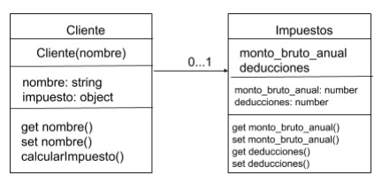

<!DOCTYPE html>
<html>

<head>
  <meta charset="utf-8">
  <meta name="viewport" content="width=device-width, initial-scale=1.0">
  <link rel="stylesheet" href="https://stackedit.io/style.css" />
</head>

<body class="stackedit">
  

    <h1 id="github-pages">Github pages</h1>
    
<a href="https://josefamendezpruebaunodl.ga/Unidad_3/3_1_VariablesYOperadoresLogicos/index.html">Vista
        del proyecto</a>

    <h1 id="desafío">Descripción </h1>
    
La empresa XYZ Consultores, necesita un sistema donde pueda registrar la información de
    sus clientes, para poder calcular el impuesto anual que debe pagar cada cliente según el
    monto total de ventas y deducciones anuales entregado, el cálculo se realizará mediante la
    siguiente fórmula:
     
     
    <i><b>Fórmula: ((monto_bruto_anual − deducciones) * 21%)</b></i>
     
     
   La empresa solicita desarrollar un programa con JavaScript utilizando las nuevas
  tecnologías de ES6, considerando clases y que las modificaciones y consultas sean
  mediante métodos específicos. Igualmente, desea que se apliquen archivos por separado
  para facilitar el mantenimiento del sistema a futuro, implementando módulos de ES6 y
  posteriormente transpilar el código mediante Babel.
     
     
    Para ello, la empresa entrega el diagrama de clases a través de la siguiente imagen, con las
    características básicas de lo que se debe diseñar y programar mediante la reseña de cardinalidad. En este caso, debes utilizar Node y Babel para ejecutar tu código, ya que solo debes realizar el programa en JavaScript, creando tres archivos, un archivo principal o main,y otros dos archivos para cada una de las clases.
     
     
         
    

    <h1>Requerimientos</h1>
    <ol>
        <li>
         Mantén un estilo de código (espacios, saltos de línea, indentación) uniforme en el
        proyect   
        </li>
         
        <li>
        Utilizar ES6 para el desarrollo de todo el programa.   
        </li>
         
        <li>
         Implementar las funcionalidades de Babel instalando las dependencias necesarias
          para su funcionamiento.
        </li>
         
        <li>
         Crear y configurar el archivo de babel.config.json.
        </li>
         
        <li>
        Crear los tres archivos de JavaScript e implementar la modularidad y clases de ES6
        </li>
         
        <li>
        Implementar getter y setter para acceder y/o modificar los datos de las clases.
        </li>
         
        <li>
        Implementar un método que permita calcular el impuesto total a pagar por parte del
        cliente.
        </li>
         
        <li>
        Transpilar el código de ES6 a ES5 utilizando babel desde la terminal
        </li>
    </ol>
  

</body>

</html>
